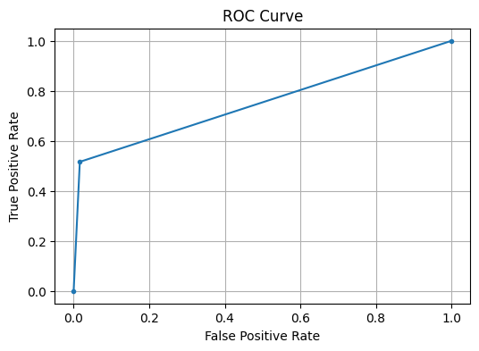

# Credit Card Fraud Detection

This project uses **Isolation Forest**, an unsupervised machine learning model, to detect fraudulent transactions in credit card data.

## Dataset
- [Credit Card Fraud Detection Dataset](https://www.kaggle.com/mlg-ulb/creditcardfraud)

## Model
- Isolation Forest
- Handles class imbalance using selective undersampling

## Output
- ROC-AUC Score
- Confusion Matrix
  [[4754 79]
[ 238 254]]
- Classification Report
- ROC Curve Plot 

  ## 📈 Evaluation
- **ROC-AUC Score:** 0.75
- **Accuracy:** 94%
- **Precision (Fraud):** 76%
- **Recall (Fraud):** 52%
- **F1 Score (Fraud):** 0.62

## How to Run
Open the notebook in Google Colab and upload the dataset when prompted.

---

Made with ❤️ for the challenge submission.
